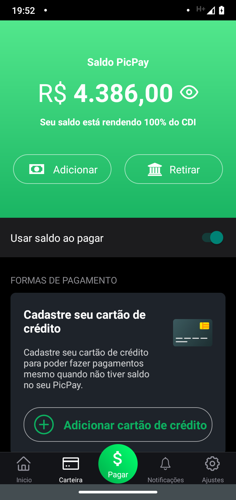

# PicPay UI Clone

[](https://sonarcloud.io/dashboard?id=leandross86_PicPay_Clone_React_Native) <a href="./LICENSE">

</a> 


    


## Objetivo

Objetivo de criar um clone do aplicativo PicPay utilizando React Native, Styled Components e React Navigation 5.

Este projeto utiliza o [Expo](https://expo.io/).

## Instalação

Você precisará ter apenas o [NodeJS](https://nodejs.org) instalado na sua máquina, e após isso, clonar este repositório:
```sh
  $ git clone https://github.com/leandross86/PicPay-Clone-ReactNative
```

Depois disso acesse odiretório e instale as dependências executando o seguinte comando:
```sh
  $ yarn install # ou npm install
```

## Executando a aplicação

Execute o comando a baixo para inicializar o Expo:
```sh
  $ yarn start # ou npm start
```

Agora basta abrir o emulador pelo seu computador, ou o aplicativo do Expo no seu celular (disponível na [App Store](https://apps.apple.com/br/app/expo-client/id982107779) e na [Google Play](https://play.google.com/store/apps/details?id=host.exp.exponent&hl=pt_BR)).

## 🤝 Créditos

[Mateus Silva](https://github.com/maateusilva)

## 🧱Status: Em desenvolvimento

Desenvolvido com ❤ por Leandro Souza
